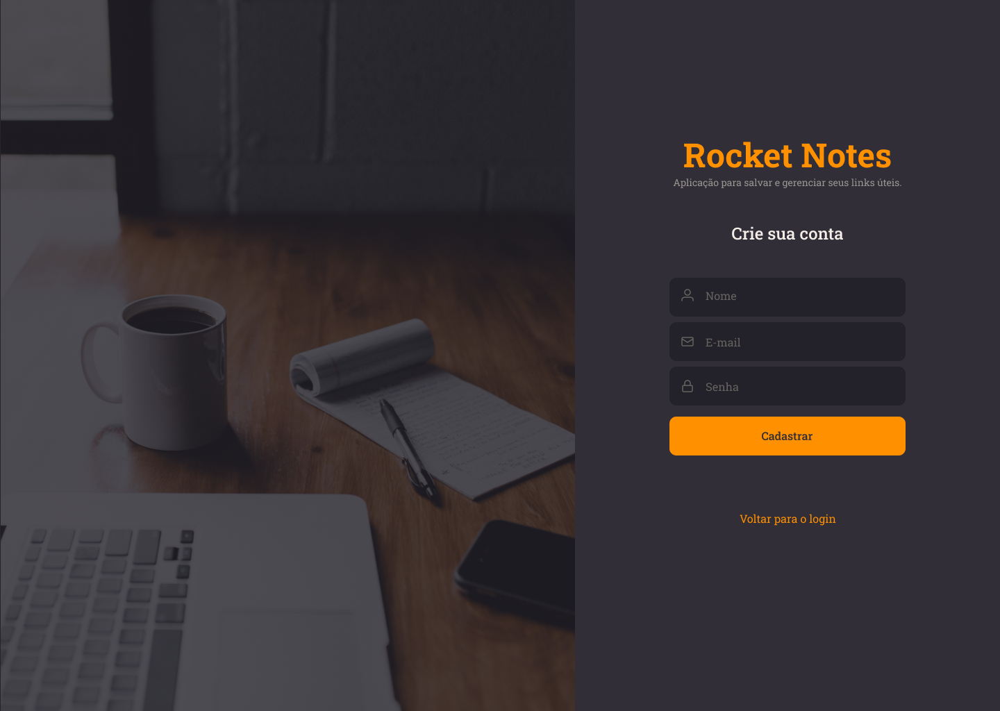
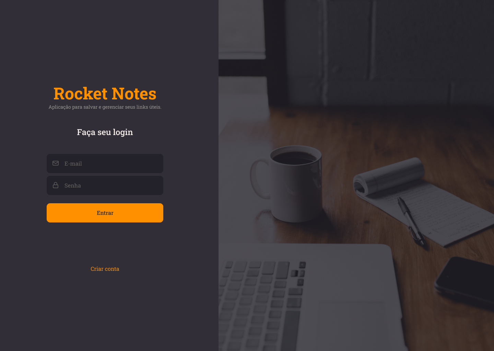
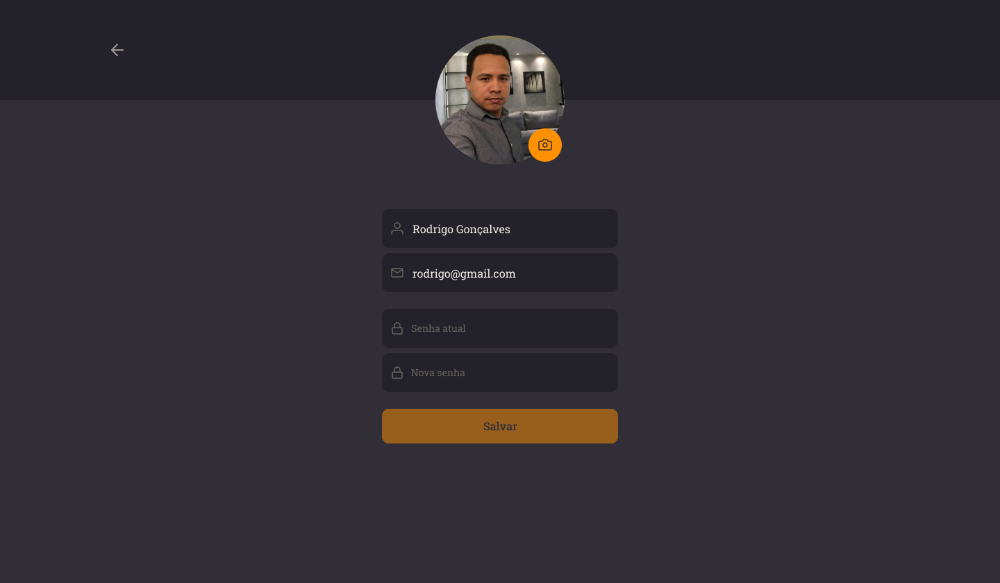
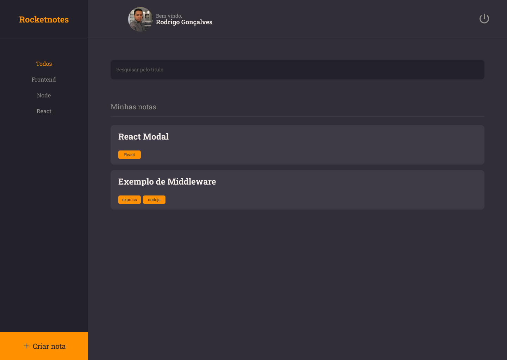

<h1 align="center"> Projeto Notpad </h1>

Desenvolvido por Ivan Barbosa. 
Visite o projeto finalizado https://notepadss.netlify.app/  
Layout UI/UX RocketSeat.

  <a href="#-tecnologias">Tecnologias</a>&nbsp;&nbsp;&nbsp;|&nbsp;&nbsp;&nbsp;
  <a href="#-projeto">Projeto</a>&nbsp;&nbsp;&nbsp;|&nbsp;&nbsp;&nbsp;
  <a href="#-layout">Layout</a>&nbsp;&nbsp;&nbsp;|&nbsp;&nbsp;&nbsp;
  <a href="#memo-licença">Licença</a>

  
  

  
  

  
  

 

## 🚀 Tecnologias

Esse projeto foi desenvolvido com as seguintes tecnologias:

- React
- CSS / Styled Components
- Node.js
- JavaScript
- Git e Github

## 💻 Projeto

Cadastre suas notas. 
A aplicação foi desenvolvida em React. Onde após criar o cadastro e fazer Login. O usuário vai cadastrar notas, criar tags e links.

## 🔖 Layout

Layout UI/UX RocketSeat. 
https://www.rocketseat.com.br/

Você pode visualizar o layout do projeto através [DESSE LINK](https://www.figma.com/file/ZSIcsdJuOhd9y9ESXN1KYd/RocketNotes-(Copy)?node-id=42%3A27&t=rEFIbwdf0LaIWxtp-0). É necessário ter conta no [Figma](https://figma.com) para acessá-lo.

## :memo: Licença

Esse projeto está sob a licença MIT.

---
